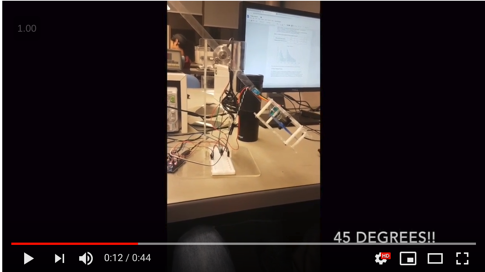

# Propeller-Control-System

### Contol of a propeller is to achieve 3 objectives:

1. Step to 45 degrees given, Overshoot, Settling time and Rise time minimum requirements
2. Recover from a perterbation given same requirements
3. Trace a sine wave input

##

 
